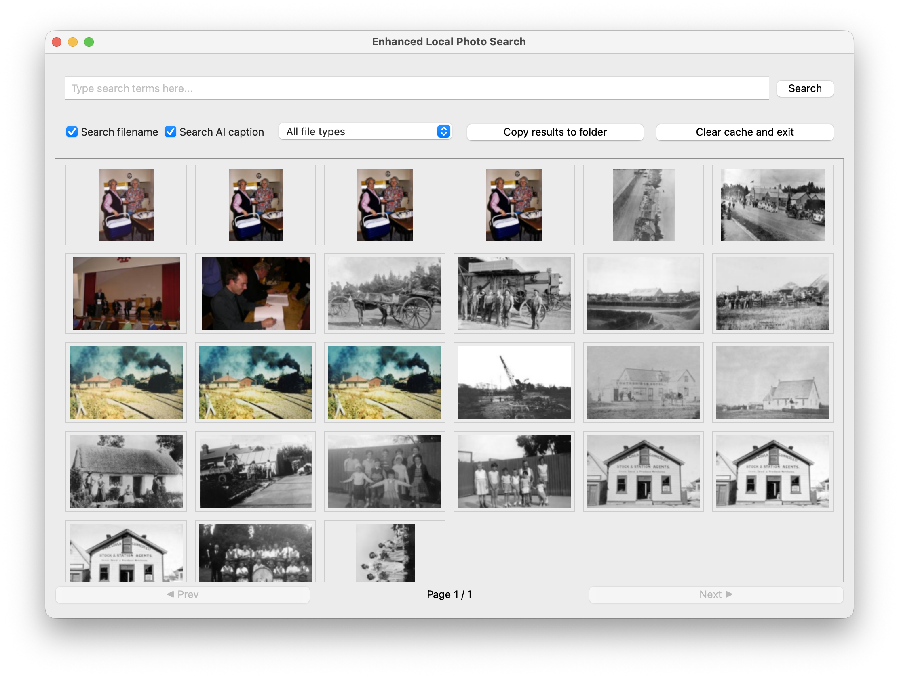
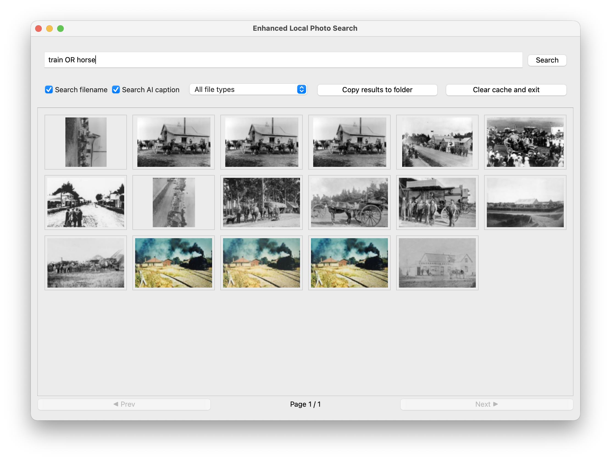

# Enhanced Local Photo Search

A simple desktop application to search photos in a folder, using both the filename and an AI generated description of the content.

### Cached Data

When a folder is opened with the program for the first time, the program will generate thumbnails and search index. These are cached under `.thumbnails/` and `.search-index` respectively. New photos will be added to the cache when the program opens the folder. If you no longer want the cache, clicking `Clear cache and exit` will delete the cache for the current folder.

### Export Results

When your have the desired results for your query, clicking `Copy results to folder` will open a folder selection dialog to choose where to copy the results to.

## Advanced Search

### Choose Source
Use the checkboxes to enable and disable whether the content of the filename and AI output are being searched. 

### Filter by Image Type
Choose an image file type from the dropdown to filter the results to that type (e.g. `JPEG`, `TIFF`).

### Boolean Expression

The search field allows for Boolean operations (`AND` and `OR`) with the query.

- Defaults to an `AND` operation (e.g. `horse parade` evaluates as `horse AND parade`)
- Operations are case-sensitive (e.g. `horse and parade` evaluate as `horse AND and AND parade`)
- Right associative (e.g. `train OR horse AND building` evaluates as `train OR (horse AND building)`)
- Applies parentheses (e.g. `(train OR horse) AND building` will evaluate the `OR` first)
- Short circuit evaluation (e.g. `train OR (horse AND building)` will not evaluate the second half of the expression if there is a match on `train`)

## Future Work
- Improve captioning model (currently using [vit-gpt2-image-captioning](https://huggingface.co/nlpconnect/vit-gpt2-image-captioning), an image tagging model may work better)
- Faster search algorithm (current search algorithm is basic and may be able to be optimised)
- Fuzzy search
- Word embeddings to match words with similar meanings (e.g. `railway <-> train`)